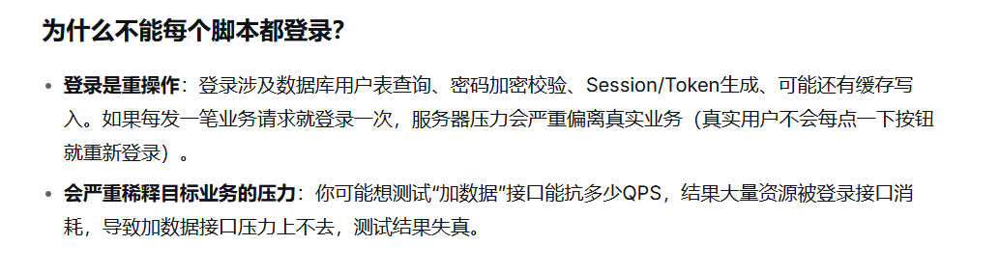

## 性能测试要点
### 测试用户
选择不同region的ADMIN用户

### POST 请求参数
 - 服务端在处理请求参数时，采取了“忽略未知或不必要参数”的宽容策略。
 - add的参数可以固定，不是非得随机
### CSS/JS请求
排除。
理由有四点：
第一，你关注的核心风险都在后端——POST case 的事务锁（PERF-001）、case 表索引（PERF-004）、连接池耗尽（PERF-003）。CSS/JS 的加载时间不会告诉你这些。
第二，记录管理系统是内部工具，50 个用户，静态资源大概率部署在同一内网服务器上，浏览器首次加载后会强缓存（304 或 from disk cache），后续请求不再传输。在脚本里每次迭代都拉一遍 CSS/JS，反而夸大了真实负载。
第三，GET /case/add/page 这个请求本身已经覆盖了页面渲染的"首字节时间"（TTFB）和服务端的模板/视图层开销。CSS/JS 的加载属于客户端渲染阶段，测的是网络和浏览器，不是你写的那部分代码。
第四，如果你确实关心页面整体加载体验，用浏览器的 Lighthouse 或 WebPageTest 对单个页面做一次审计，比在 JMeter 里维护 20 个静态资源请求更有效。

如果要做，推荐做法不是手写每一个 CSS/JS 请求，而是在 JMeter 里用 HTTP Request Defaults 配合 Retrieve All Embedded Resources：
HTTP Request: GET /case/add/page
  └── Advanced 标签 → ☑ Retrieve All Embedded Resources
      └── Embedded URLs must match: .*\.(css|js|png|jpg|svg|woff2).*
这样只需维护一个请求，JMeter 自动解析 HTML 中的资源引用并并发下载。注意勾选 Parallel downloads（默认 6 个并发），才能模拟浏览器的真实行为。
### CAD2RMS

### SKILL 生成jmeter脚本
#### 生成测试计划+Jemter项目结构
https://github.com/proffesor-for-testing/agentic-qe/tree/main/assets/skills/performance-testing
#### 生成jmeter脚本
fiddler录制
SKILL处理：参数化、POST请求体编码？问题（从saz文件里获取请求体内容加到JMX里？）
通过脚本反写用例

1、写死固定值适合业务里本来就会长期存在、且不会被并发抢改的数据，比如某个一直可用的配置项、枚举、公共账号下的固定资源
2、要从前置请求或 CSV 里取的，一般是会变、会冲突、或一跑就失效的数据。比如订单号、用户 token、一次性券码、获取可能会被人删除的数据
3、至于你说的场景，如果只是验证添加接口本身能扛多少量，查询结果又长期稳定，可以把要加的参数写死，或事先导出到 CSV，不必每次脚本里再查一遍。若产品真实路径就是查完再选，或者查出来的数据会过期、会被删，就应前置查一次再带进添加，更加符合实际业务场景
4、参数全动态会对结果有影响。多一次查询会有一定的时间成本；CSV 读文件一般开销很小，通常可忽略。所以得看压测目标：测添加接口就尽量把查拆开或写死；测整段用户路径，就把查和加串在一起，接受总耗时里包含查询。

---
Readme.md
本Skill用于将Fiddler录制的请求转换为Jmeter性能测试脚本。运行过程分两个阶段，第一阶段输出测试计划，需用户确认；第二阶段根据测试计划生成Jmx脚本。
## 需要用户提供的内容
1. 使用skill时需说明Fiddler请求文件位置，要做的性能测试内容（负载测试？高并发测试？并发数及持续时间？）
例如：
- 我要用/file/PA40_Incident report.saz做性能测试，使用$jmeter-loader-skills 技能分析。做负载测试，并发数为5，持续10分钟
- 使用$jmeter-loader-skills 把/file/PA40_Incident report.saz转换为jmeter脚本。并发数为1,case_id从csv文件中循环读取。
2. [非必须] 可以简单描述脚本的操作流程以及其它信息，帮助AI分析。
例如：
- xx页面的参数使用抓包的静态值，xx参数从文件中读取。
- 这个流程包含A和B操作，删除xx页面相关请求。
3. 在第一阶段结束后，查看测试计划中的**断言**和需要用户确认的内容，按提示说明要添加的断言类型和位置，以及其它需要确认的信息。批准进入下一步。

---

